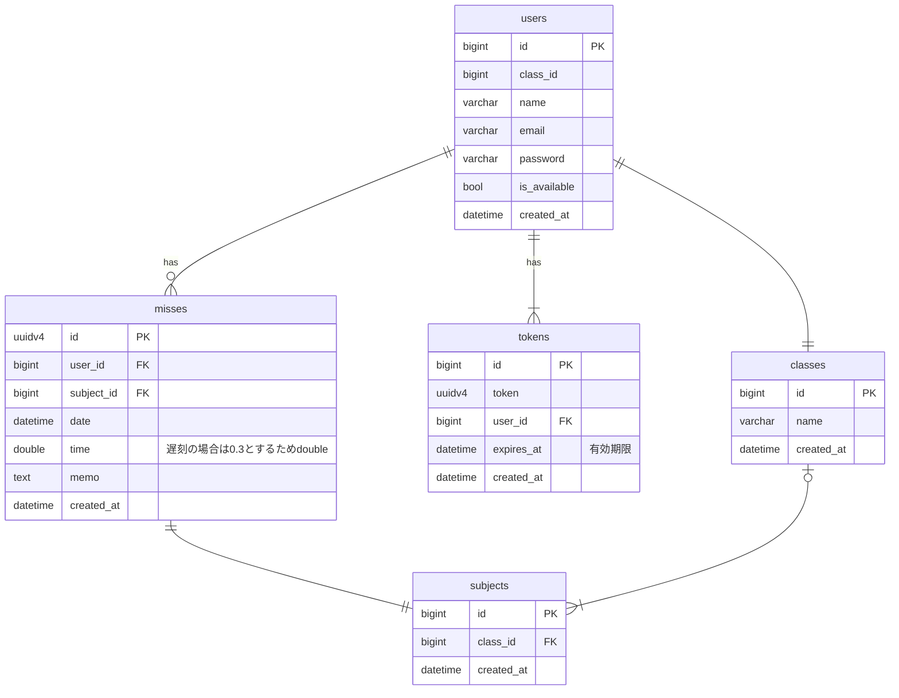

# API Document

## ER Diagram

## Endpoints (Request and Response sample)
- POST /login
  - req
    `POST /login`
    ```json
    {
      "email": "xxx@example.com",
      "password": "xxxxxx"
    }
    ```
  - res
    ```json
    {
      "code": 0,
      "token": "xxxx" //(:uuidv4)
    }
    ```

- GET /auth
  - req
    `GET /auth?token={token: str}`
  - res
    ```json
    {
      "code" : 0,
      "user" : {
          "name" : "test1",
          "email" : "xxx@xxx.com"
        }
    }
    ```

- GET /misses
  - req
    `GET /misses?token={:token}`
  -res
    ```json
    {
      "code": 0,
      "miss": [
        {
          "subject": "数学",
          "missTime": 10,
          "totalTime": 30
        }
      ]
    }
    ```

- GET /misses/all
  - req
    `GET /misses/all?token={token: str}`
  - res
    ```json
    {
      "code" : 0,
      "misses" : [
        {
          "id" : "xxxx", // (:uuidv4)
          "subject" : "英語Ⅲ",
          "time" : 2,
          "date" : 2023-11-11
        }
      ]
    }
    ```

- GET /miss/{:id}
  - req
    `GET /miss/{id: str}?token={token: str}`
  - res
    ```json
    {
      "code" : 0,
      "miss" : {
        "id" : "xxxx", // (:uuidv4)
        "subject" : "英語Ⅲ",
        "date" : 2023-11-11,
        "time" : 2,
        "memo" : "寝坊"
      }
    }
    ```

- PUT /miss/{:id}
  - req
    `PUT /miss/{id: str}?token={token: str}`
    ```json
    {
      "time" : 2,
      "date" : 2023-11-11,
      "memo" : "大寝坊"
    }
    ```
  - res
    ```json
    {
      "code" : 0,
      "miss" : {
        "id" : "xxxx", // (:uuidv4)
        "subject" : "英語Ⅲ",
        "date" : 2023-11-11,
        "time" : 2,
        "memo" : "大寝坊"
      }
    }
    ```

- POST /register
  - req
    `POST /register?token={:token}`
    ```json
    {
      "subject": "数学",
      "date": 2023-11-22,
      "memo":"寝坊"
    }
    ```
  - res
    ```json
    {
      "code": 0 //success
    }
    ```
- GET /subject
  - req
    `GET /subject?token={:token}`
  - res
    ```json
    {
      "code" : 0,
      "subjects" : ["応用数学α", "英語Ⅲ", "情報工学実験"]
    }
    ```
